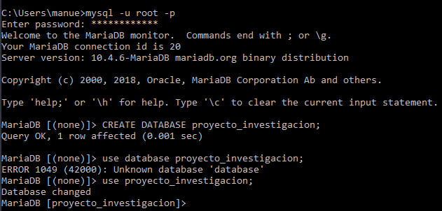
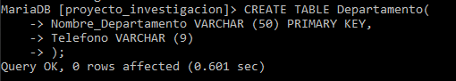
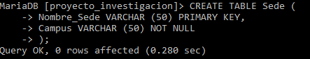
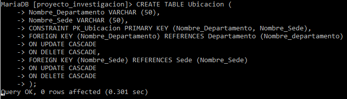
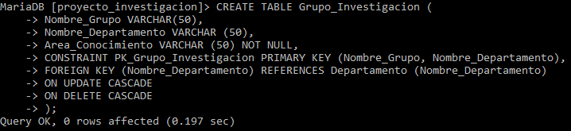
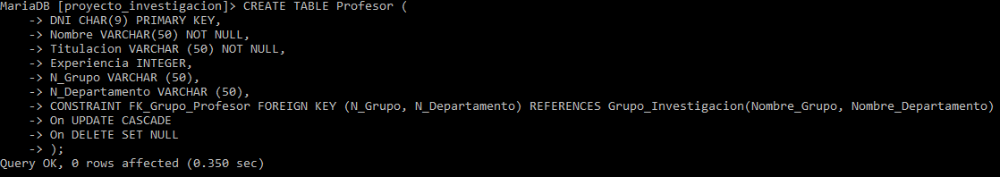

## Creación de las base de datos en MariaDB ##
Tras hacer los 2 ejercicios los pasaremos a MariaDB usando la ventana de comandos. 

### INDICE ###
- [Ejercicio 1](#ej1)
	- [creación base de datos](#CBDD)
	- [creación tablas](#CT)
- [Ejercicio 2](#ej2)

### Ejercicio 1  ###
Antes  de empezar el ejercicio hay que especificar un poco los criterios que seguiremos para hacer la base de datos.

- Prohibido usar acentos y espacios. Usaremos _ para como espacio.
- No se pueden crear dominios.
- Añadiremos `ALTER` al final del ejercicio por si se nos olvidar añadir algún dato.

#### Creación Base de datos  ####
Abrimos la ventana de comandos y entramos en MariaDB con el comando `mysql -u root -p` y creamos la base de datos `CREATE DATABASE proyecto_investigacion` y escribimos `use proyecto_investigacion` para usar esa base de datos para el ejercicio.

#### Creación tablas  ####
Empezamos a crear las tablas.

##### Departamento #####
	CREATE TABLE Departamento (
    	Nombre_Departamento VARCHAR(50) PRIMARY KEY,
    	Teléfono            VARCHAR(9)
	);
En MariaDB:

##### Sede #####
	CREATE TABLE Sede (
    	Nombre_Sede VARCHAR(50) PRIMARY KEY,
    	Campus      VARCHAR(50) NOT NULL
	);
En MariaDB:

##### Ubicación #####

	 CREATE TABLE Ubicación (
    	Nombre_Departamento VARCHAR(50),
    	Nombre_Sede         VARCHAR(50),
    	CONSTRAINT PK_Ubicación PRIMARY KEY (Nombre_Departamento, Nombre_Sede),
    	FOREIGN KEY (Nombre_Departamento) REFERENCES Departamento(Nombre_Departamento) 
    	ON UPDATE CASCADE 
    	ON DELETE CASCADE,
    	FOREIGN KEY (Nombre_Sede) REFERENCES Sede (Nombre_Sede) 
    	ON UPDATE CASCADE 
    	ON DELETE CASCADE
	);
En MariaDB:

##### Grupo investigación #####

	CREATE TABLE Grupo_Investigación (
    	Nombre_Grupo        VARCHAR(50),
    	Nombre_Departamento VARCHAR(50),
    	Área_Conocimiento   VARCHAR(50) NOT NULL,
    	CONSTRAINT PK_Grupo_Investigación PRIMARY KEY (Nombre_Grupo, Nombre_Departamento),
    	FOREIGN KEY (Nombre_Departamento) REFERENCES Departamento(Nombre_Departamento) 
	    ON UPDATE CASCADE 
	    ON DELETE CASCADE
	);
En MariaDB:

##### Profesor #####

	 CREATE TABLE Profesor (
    	DNI            CHAR(9) PRIMARY KEY,
    	Nombre         VARCHAR(50) NOT NULL,
    	Titulación     VARCHAR(50) NOT NULL,
    	Experiencia    INTEGER,
    	N_Grupo        VARCHAR(50),
    	N_Departamento VARCHAR(50),
    	CONSTRAINT FK_Grupo_Profesor FOREIGN KEY (N_Grupo, N_Departamento) REFERENCES Grupo_Investigación(Nombre_Grupo, Nombre_Departamento)
    	ON UPDATE CASCADE 
    	ON DELETE SET NULL  
	);	
En MariaDB:

